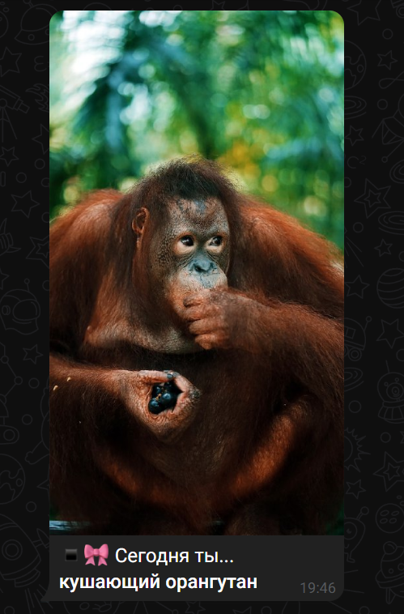
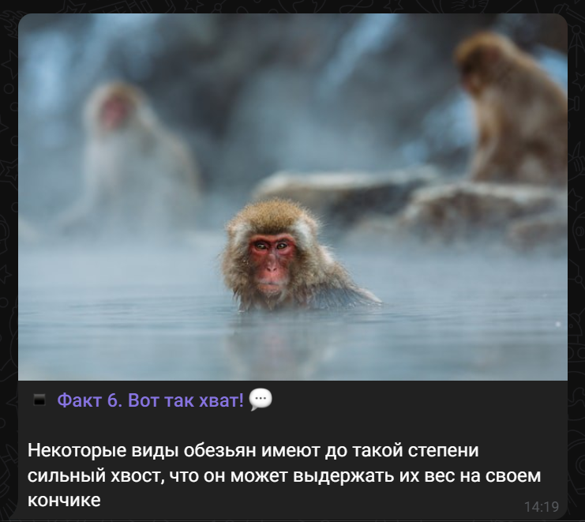

    
&#129447;

<h3 align="center">
    <b>
        Eco Monkey
    </b>
</h3>

    Маленький, уютный и забавный Telegram-бот, посвященный обезьянкам
     
    <a href="https://t.me/EcoMonkeyBot">
        <h4 align="center">
            <b>
                Попробовать »
            </b>
        </h4>
    </a>

 

 

<h1 align=center>
    <b>
        Фильтры
    </b>
</h1>

<table align="center">
    <tr>
        <td align="center">
            
             
            
                <b>
                    Оригинал
                </b>
            
        </td>
    </tr>
</table>

 
 

<table align="center">
    <tr>
        <td align="center">
            
             
            
                <b>
                    Черно-белый
                </b>
            
        </td>
        <td align="center">
            
             
            
                <b>
                    Двусторонний фильтр
                </b>
            
        </td>
        <td align="center">
            
             
            
                <b>
                    Размытие по Гауссу
                </b>
            
        </td>
    </tr>
    <tr>
        <td align="center">
            
             
            
                <b>
                    Инверсия
                </b>
            
        </td>
        <td align="center">
            
             
            
                <b>
                    Ретро
                </b>
            
        </td>
        <td align="center">
            
             
            
                <b>
                    Выделение границ
                </b>
            
        </td>
    </tr>
</table>

 

 

<h1 align=center>
    <b>
        Генетический тест
    </b>
</h1>

<table align="center">
    <tr>
        <td align="center">
            
        </td>
    </tr>
    <tr>
        <td align="center">
            
        </td>
    </tr>
    <tr>
        <td align="center">
            
        </td>
    </tr>
</table>

 

 

<h1 align=center>
    <b>
        Кто ты сегодня
    </b>
</h1>

<table align="center">
    <tr>
        <td align="center">
            
        </td>
    </tr>
</table>

 

 

<h1 align=center>
    <b>
        Интересные факты
    </b>
</h1>

<table align="center">
    <tr>
        <td align="center">
            
        </td>
    </tr>
</table>
